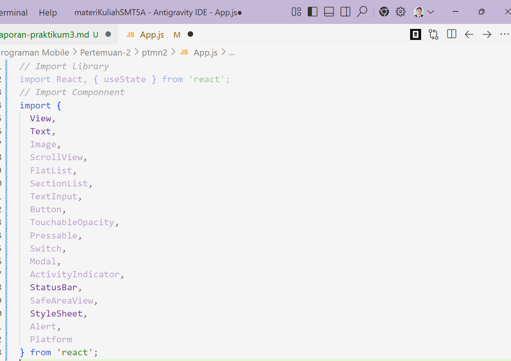
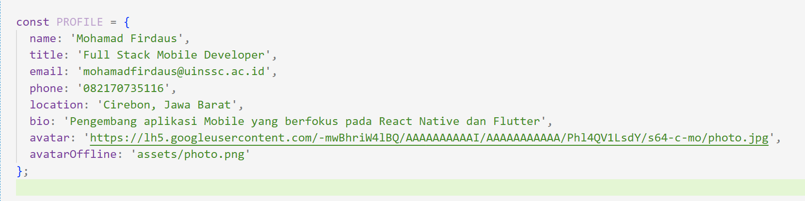

# 📱Modul Praktikum 4: Core Components & Styling #

## 🎯 Tujuan Pembelajaran

Setelah menyelesaikan praktikum ini, mahasiswa mampu:

1. Memahami dan menggunakan **16 Core Components** React Native
2. Menerapkan **StyleSheet** untuk styling terpusat
3. Menggunakan **useState** untuk state management dasar
4. Membuat layout yang responsif dengan **Flexbox**
5. Menangani **interaksi pengguna** (tekan, input, scroll)

## 📲 Praktikum ##

### Langkah 1: Import Libarary & Components ###

1. Buka File App.js pada folder projek ptmn2
2. Import Library dan Core Component yang dibutuhkan
3. Konfirmasi bukti

### Langkah 2: Menyiapkan Array Objek untuk menampung data ###

1. Membuat Array Objek bernama PROFILE untuk menampung data Profile
2. Konfirmasi bukti

## Lanjutkan sampai selesai.... ##

### Hasil Akhir ###

